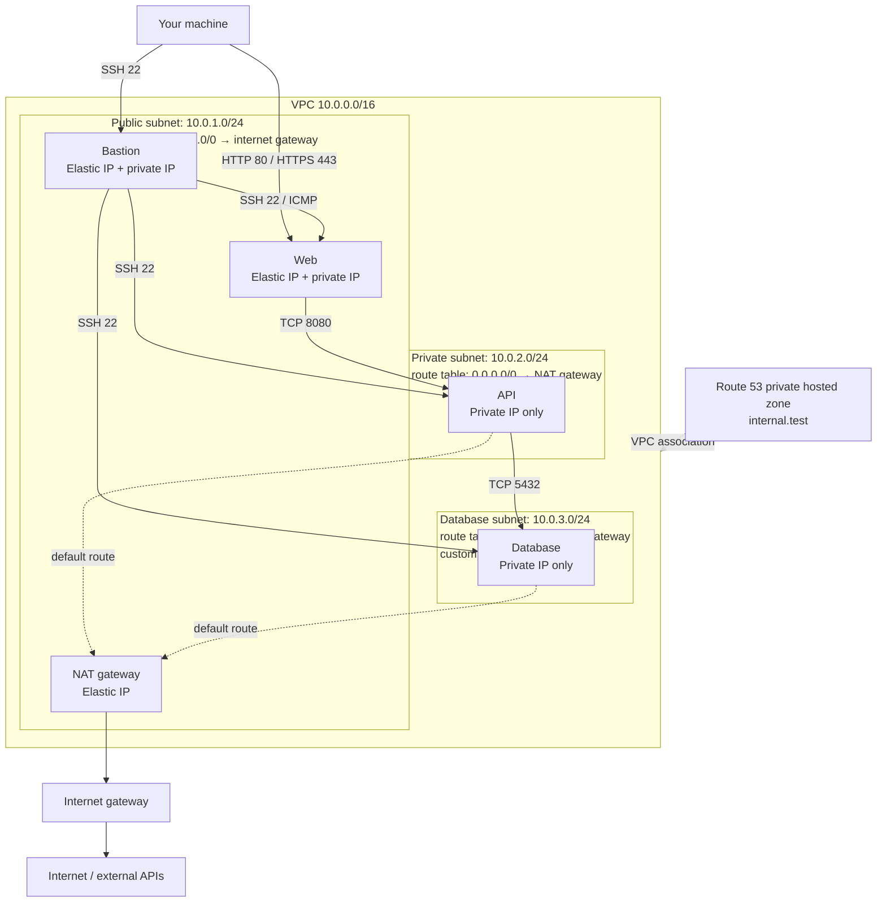

# AWS Networking Lab

A realistic network troubleshooting exercise. You're the on-call engineer—diagnose and fix.



Intended traffic after repairs. Dashed lines show route targets and resource
associations. In AWS an instance's public IP only works when its subnet routes
`0.0.0.0/0` to the internet gateway, so the web server lives in the public
subnet; the API is the only instance in the private subnet.

## Contents

- [Prerequisites](#prerequisites)
- [Getting Started](#getting-started)
- [Getting Help](#getting-help)
- [Incident Queue](#incident-queue)
- [Verify Your Fixes](#verify-your-fixes)
- [Clean Up](#clean-up)

---

## Prerequisites

- **AWS CLI** installed and authenticated (e.g., `aws configure`); confirm the
  account and region with `aws sts get-caller-identity` and `aws configure get region`
- **IAM permissions** to manage VPC networking, EC2, Route 53 private zones, and NAT gateways
- **Bash**, **OpenSSH client**, **Python 3.9+**, **curl**, and **OpenSSL** installed locally
- **Terraform** installed (1.4+)
- **jq** installed for JSON parsing ([Download jq](https://jqlang.org/download/))

The default region is `us-east-1`. Set `TF_VAR_aws_region` before running setup
to deploy elsewhere; the scripts read the region from Terraform outputs.

---

## Getting Started

1. Navigate to the scripts directory:
   ```bash
   cd aws/scripts
   ```

2. Make scripts executable:
   ```bash
   chmod +x *.sh
   ```

3. Run the setup script:
   ```bash
   ./setup.sh
   ```

Wait for **READY TO START** and the SSH connection instructions. Setup deploys
with a working NAT route so the instances can install packages, waits for
cloud-init and healthy local services on all four instances, and only then
prepares the incidents. If it fails, inspect the error and retry, or run
`./destroy.sh` to avoid charges.

**Cost**: ~$0.50-1.00/session (four `t3.micro` instances, a NAT gateway, and
three public IPv4 addresses). Destroy when done.

---

## How This Lab Works

This lab has **two separate activities**:

- **Diagnose via SSH** — The setup script gives you an SSH command to connect through the bastion host. Use it to hop into instances and check what's broken (test connectivity, resolve DNS, curl endpoints, etc.).
- **Fix via AWS CLI** — Once you know the root cause, open a separate terminal on your **local machine** and fix the misconfigured cloud resources using `aws` commands (e.g., fix security groups, route tables, network ACLs, DNS records).

Do **not** edit Terraform files to fix issues. Do **not** try to fix things from inside the instances. The cloud infrastructure is what's broken — fix it with the cloud CLI.

After fixing, run `./validate.sh` to confirm.

Use `./setup.sh`, not Terraform alone, to prepare the incidents. Rerunning setup
reapplies Terraform (which resets the lab's security groups, network ACL, and
routes, but keeps the instances) and prepares the faults again; Route 53
records you added remain. It is not a progress checker. Recreate older labs
rather than updating them in place.

---

## Getting Help

If you run into issues (broken instructions, validation failures you can’t explain, or suspected bugs), please open a **GitHub Issue** in this repo:

- [Open an issue](https://github.com/learntocloud/networking-lab/issues/new/choose)
- Include: incident ID (e.g., INC-4521), what you tried, and `./validate.sh` output (redact secrets/tokens).

---

## Incident Queue

You're on call. Four tickets just came in. Your job: diagnose and fix.

Replace `<..._IP>` with the addresses from setup. Run each diagnostic on the
machine listed, using `ubuntu` unless you configured a different username.
Setup also prints the IDs of the private route table, NAT gateway, database
network ACL, Route 53 zone, and security groups for use with the AWS CLI.

### 🎫 INC-4521: API service can't pull external data

**Priority:** High  
**Reported by:** Backend Team  
**Time:** 09:47 AM

> "Our API service that runs on the private subnet stopped being able to fetch data from external APIs this morning. We didn't change anything on our end. Requests to third-party services just hang and timeout. SSH, public DNS, and local API health checks still work."

**Affected system:** API server (private subnet)

**Done when:** The API can reach external HTTPS through the lab's NAT gateway
while remaining private (no public IP). Check the route table that actually
applies to the API's subnet (an explicit association, or the VPC's main route
table), its `0.0.0.0/0` target, and the NAT gateway's state and Elastic IP.

| Run from | Command | Expected result |
|----------|---------|-----------------|
| API | `curl -4 --noproxy '*' -sS -o /dev/null -w '%{http_code}\n' --max-time 10 https://example.com` | `200` |
| API | `curl -4 --noproxy '*' -fsS --max-time 10 https://api.ipify.org` | The NAT gateway's Elastic IP. |

---

### 🎫 INC-4522: Service discovery broken

**Priority:** High  
**Reported by:** Platform Team  
**Time:** 10:15 AM

> "Our applications can't resolve internal hostnames anymore. We've been using `web.internal.test`, `api.internal.test`, and `db.internal.test` for service discovery but they stopped resolving. Public DNS works fine - we can resolve google.com. This is blocking deployments."

**Affected systems:** Bastion, web, API, and database

**Done when:** All three service names resolve exclusively to their correct
private IPv4 addresses through the Amazon-provided DNS resolver and the system
resolver on all four instances. Check the Route 53 private hosted zone, its
association with the lab VPC, the VPC's DNS settings, and the zone's records.
Hosts-file-only workarounds do not count.

| Run from | Command | Expected result |
|----------|---------|-----------------|
| Each instance | `dig +short @169.254.169.253 web.internal.test A` | Only the web instance's private IP. |
| Each instance | `getent ahostsv4 web.internal.test` | The same private IP; repeated rows are normal. |

Repeat for `api.internal.test` and `db.internal.test`, expecting their respective IPs.

---

### 🎫 INC-4523: Web frontend can't reach backend

**Priority:** Critical  
**Reported by:** Web Team  
**Time:** 10:32 AM

> "The web frontend suddenly can't connect to the API backend. Connections to port 8080 time out. The API health endpoint works when we curl localhost on the API server itself, so the service is running. The API team also reports timeouts reaching the database on port 5432, although PostgreSQL accepts connections locally on the database server."

**Affected systems:** Web server → API server, API server → Database

**Done when:** Both application paths respond, not just their TCP ports.

| Run from | Command | Expected result |
|----------|---------|-----------------|
| Web | `curl --noproxy '*' -fsS --max-time 5 http://<API_PRIVATE_IP>:8080/health` | JSON with `"status": "healthy"`. |
| API | `pg_isready -h <DB_PRIVATE_IP> -p 5432 -U labuser -d labdb -t 3` | `accepting connections` |

These checks use private IPs, independently of NAT and DNS repairs. The API's
`/db-check` endpoint also needs INC-4522. A packet has to pass the source
security group's **outbound** rules, the destination subnet's network ACL (in
rule-number order, and stateless, so return traffic needs its own allowance),
and the destination security group's **inbound** rules. Security groups are
stateful, so a permitted request's reply is always allowed back.

---

### 🎫 INC-4524: Security audit findings

**Priority:** Medium  
**Reported by:** Security Team  
**Time:** 11:00 AM

> "Our quarterly security scan flagged several issues with the network segmentation:
> 
> 1. SSH rules are too broad. Restrict bastion SSH to your current public IPv4 address (`/32`), and web, API, and database SSH to the bastion security group.
> 2. Database accepts connections on port 5432 from too broad a range — it should only accept connections from the API security group.
> 3. ICMP is open from anywhere on the web server — it should only be allowed from the bastion security group.
> 
> These need to be tightened up before our compliance review next week."

**Affected systems:** Security groups

**Done when:** Only approved sources have access, and required traffic still
works. Complete INC-4523 first and preserve its fixes.

| Traffic | Approved source |
|---------|-----------------|
| Bastion SSH (TCP 22) | Your current public IPv4 `/32`, as seen by the bastion |
| Web, API, database SSH (TCP 22) | Bastion security group |
| Database TCP 5432 | API security group |
| Web ICMP | Bastion security group |

| Run from | Command | Expected result |
|----------|---------|-----------------|
| Your machine | `ssh -i ~/.ssh/netlab-key ubuntu@<BASTION_PUBLIC_IP>` | SSH session opens. |
| Bastion | `ssh <VM_PRIVATE_IP>` | SSH works to web, API, and database. |
| Your machine | `curl --noproxy '*' -kI --max-time 5 http://<WEB_PUBLIC_IP>/health https://<WEB_PUBLIC_IP>/health` | HTTP `200` from both endpoints. |
| Bastion | `ping -c 3 -W 2 <WEB_PRIVATE_IP>` | Echo replies from the web server. |
| Your machine | `nc -zvw3 <WEB_PUBLIC_IP> 22` | Connection fails or times out. |
| API | `ping -c 3 -W 2 <WEB_PRIVATE_IP>` | No echo replies. |
| Bastion | `nc -zvw3 <DB_PRIVATE_IP> 5432` | Connection fails or times out. |

The trusted `/32` is the client address seen by the bastion over SSH. If it
changes, update the bastion rule with the AWS CLI before validating. Validation
checks this address without echoing it in status output.

Security groups are stateful, allow-only, and unordered; every group attached
to an interface is additive, and there are no deny rules or priorities. The
validator evaluates the effective policy by address: it unions all matching
rules on **all** groups attached to each instance (including any port range or
all-protocol rule that covers the port), expands a security-group reference to
the interfaces that currently hold that group, resolves prefix lists, and
compares the result with the approved sources above. A `/32` for the bastion's
or API's current private IP is accepted as equivalent, and narrower rules are
fine as long as the required client keeps access. Extra groups, rules, or
referenced-group members that add any other source are rejected. Network ACLs
and outbound rules can block traffic, but they do not replace tight inbound
rules on the destination security group. The HTTPS check uses `-k` for the
lab's self-signed certificate.

---

## Verify Your Fixes

The commands above are spot checks. The validator checks cloud configuration
and live traffic: the API's effective route table and NAT gateway, DNS through
the Amazon resolver and the system resolver on all four instances, application
health over private IPs, and effective security-group sources corroborated by
allowed and denied probes. It supports the lab's single-interface, IPv4-only
topology; dual-stack VPCs, additional interfaces, and cross-account or peered
security-group references are reported as validation errors rather than
silently ignored.

Allow route, security-group, and DNS changes to propagate before retrying.
Security-group changes do not interrupt connections that are already tracked,
so use fresh connections when testing. Cached DNS answers, including cached
"no such name" answers from before a repair, can persist until their TTL
expires; setup lowers the zone's negative-caching TTL to 60 seconds, but a
change to the zone's VPC association can take several minutes to take effect.
Validation requires SSH and working diagnostic tools on all four instances.
NAT checks depend on `example.com` and `api.ipify.org` being available.

**Exit codes:** `0` = all resolved, `1` = unresolved incidents, `2` = validation
error. Completion tokens are available only when all four pass.

**When to use it:**
- After fixing an incident to confirm it's resolved
- When you think you're done with all incidents
- To generate a completion token for submission

**Check incident status:**

1. Navigate to the scripts directory:
   ```bash
   cd aws/scripts
   ```

2. Run validation:
   ```bash
   ./validate.sh
   ```

**Generate completion token:**

1. Run export:
   ```bash
   ./validate.sh export
   ```

2. Enter your GitHub username when prompted

---

## Troubleshooting

### `terraform destroy` fails with errors

If `./destroy.sh` exits with errors, it is most likely because you created cloud resources while resolving the incidents that are not tracked by Terraform. Terraform cannot delete resources it does not manage, and some AWS resources cannot be deleted while dependent resources still exist.

The destroy script removes the instances first, deletes security groups in the
lab VPC that Terraform does not manage, destroys the rest, and retries once if
something still blocks deletion. It also works after a partial destroy. Read any
remaining error message carefully — it will name the resource that is blocking
deletion (for example an Elastic IP you allocated, or a route table you
created). Delete that resource manually with the AWS CLI, then run
`./destroy.sh` again.

## Clean Up

When finished, destroy resources to avoid charges:

1. Navigate to the scripts directory:
   ```bash
   cd aws/scripts
   ```

2. Run the destroy script:
   ```bash
   ./destroy.sh
   ```

3. Confirm nothing is left: check EC2 instances, NAT gateways, Elastic IPs,
   security groups, and Route 53 private hosted zones in the region you used.

> **Note:** If `terraform destroy` fails, it's likely because you created resources via the AWS CLI (e.g., security groups, Elastic IPs, route tables) that Terraform doesn't know about. Delete those resources manually with `aws` first, then re-run `./destroy.sh`.
