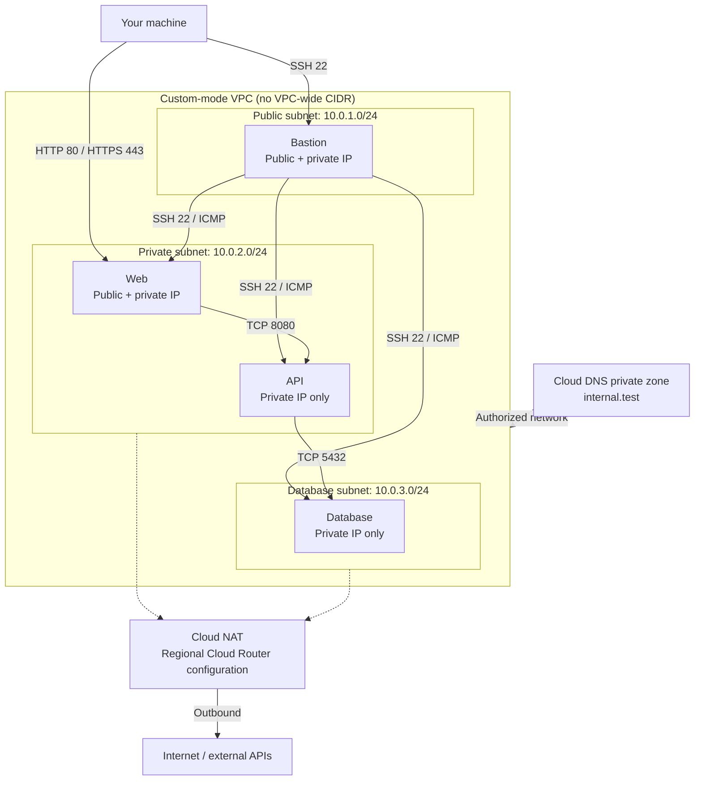

# GCP Networking Lab

A realistic network troubleshooting exercise. You're the on-call engineer—diagnose and fix.



Intended traffic after repairs. Dashed lines show resource associations.
Cloud NAT is not a VM in the public subnet; it provides outbound translation
for covered VM interfaces without external IPs.

## Contents

- [Prerequisites](#prerequisites)
- [Getting Started](#getting-started)
- [Getting Help](#getting-help)
- [Incident Queue](#incident-queue)
- [Verify Your Fixes](#verify-your-fixes)
- [Clean Up](#clean-up)

---

## Prerequisites

- **gcloud CLI** installed and authenticated (`gcloud auth login`)
- **Terraform credentials** configured (`gcloud auth application-default login`)
- **Bash**, **OpenSSH client**, **Python 3.9+**, **curl**, and **OpenSSL** installed locally
- **Terraform** installed (1.4+)
- **jq** installed for JSON parsing ([Download jq](https://jqlang.org/download/))
- **GCP project** set in gcloud (`gcloud config set project <project-id>`)

---

## Getting Started

1. Navigate to the scripts directory:
   ```bash
   cd gcp/scripts
   ```

2. Make scripts executable:
   ```bash
   chmod +x *.sh
   ```

3. Run the setup script:
   ```bash
   ./setup.sh
   ```

Wait for **READY TO START** and the SSH connection instructions. Setup waits for
GCE startup scripts and checks local services before preparing the incidents.
If it fails, inspect the error and retry, or run `./destroy.sh` to avoid charges.

**Cost**: ~$0.50-1.00/session. Destroy when done.

---

## How This Lab Works

This lab has **two separate activities**:

- **Diagnose via SSH** — The setup script gives you an SSH command to connect through the bastion host. Use it to hop into VMs and check what's broken (test connectivity, resolve DNS, curl endpoints, etc.).
- **Fix via gcloud CLI** — Once you know the root cause, open a separate terminal on your **local machine** and fix the misconfigured cloud resources using `gcloud` commands (e.g., fix firewall rules, routes, DNS records).

Do **not** edit Terraform files to fix issues. Do **not** try to fix things from inside the VMs. The cloud infrastructure is what's broken — fix it with the cloud CLI.

After fixing, run `./validate.sh` to confirm.

Use `./setup.sh`, not Terraform alone, to prepare the incidents. Rerunning setup
reapplies Terraform and prepares the faults again; it is not a progress checker.
Recreate older labs rather than updating them in place.

---

## Getting Help

If you run into issues (broken instructions, validation failures you can’t explain, or suspected bugs), please open a **GitHub Issue** in this repo:

- [Open an issue](../issues/new/choose)
- Include: incident ID (e.g., INC-4521), what you tried, and `./validate.sh` output (redact secrets/tokens).

---

## Incident Queue

You're on call. Four tickets just came in. Your job: diagnose and fix.

Replace `<..._IP>` with the addresses from setup. Run each diagnostic on the
machine listed, using `labadmin` unless you configured a different username.

### 🎫 INC-4521: API service can't pull external data

**Priority:** High  
**Reported by:** Backend Team  
**Time:** 09:47 AM

> "Our API service that runs on the private subnet stopped being able to fetch data from external APIs this morning. We didn't change anything on our end. Requests to third-party services just hang and timeout. SSH, public DNS, and local API health checks still work."

**Affected system:** API server (private subnet)

**Done when:** The API can reach external HTTPS through Cloud NAT on the lab's
Cloud Router, while remaining private (no external IP).

| Run from | Command | Expected result |
|----------|---------|-----------------|
| API | `curl -4 --noproxy '*' -sS -o /dev/null -w '%{http_code}\n' --max-time 10 https://example.com` | `200` |
| API | `curl -4 --noproxy '*' -fsS --max-time 10 https://api.ipify.org` | A public IP in the API interface's Cloud NAT mapping. |

---

### 🎫 INC-4522: Service discovery broken

**Priority:** High  
**Reported by:** Platform Team  
**Time:** 10:15 AM

> "Our applications can't resolve internal hostnames anymore. We've been using `web.internal.test`, `api.internal.test`, and `db.internal.test` for service discovery but they stopped resolving. Public DNS works fine - we can resolve google.com. This is blocking deployments."

**Affected systems:** Bastion, web, API, and database

**Done when:** All three service names resolve exclusively to their correct
private IPv4 addresses through cloud and system DNS on all four VMs. GCP uses
the metadata server (`169.254.169.254`) for these DNS queries; private zones
must authorize the VPC. Hosts-file-only workarounds do not count.

| Run from | Command | Expected result |
|----------|---------|-----------------|
| Each VM | `dig +short @169.254.169.254 web.internal.test A` | Only the web VM's private IP. |
| Each VM | `getent ahostsv4 web.internal.test` | The same private IP; repeated rows are normal. |

Repeat for `api.internal.test` and `db.internal.test`, expecting their respective IPs.

---

### 🎫 INC-4523: Web frontend can't reach backend

**Priority:** Critical  
**Reported by:** Web Team  
**Time:** 10:32 AM

> "The web frontend suddenly can't connect to the API backend. Connections to port 8080 time out. The API health endpoint works when we curl localhost on the API server itself, so the service is running. The API team also reports timeouts reaching the database on port 5432, although PostgreSQL accepts connections locally on the database server."

**Affected systems:** Web server → API server, API server → Database

**Done when:** Both application paths respond, not just their TCP ports.

| Run from | Command | Expected result |
|----------|---------|-----------------|
| Web | `curl --noproxy '*' -fsS --max-time 5 http://<API_PRIVATE_IP>:8080/health` | JSON with `"status": "healthy"`. |
| API | `pg_isready -h <DB_PRIVATE_IP> -p 5432 -U labuser -d labdb -t 3` | `accepting connections` |

These checks use private IPs, independently of NAT and DNS repairs. The API's
`/db-check` endpoint also needs INC-4522.

---

### 🎫 INC-4524: Security audit findings

**Priority:** Medium  
**Reported by:** Security Team  
**Time:** 11:00 AM

> "Our quarterly security scan flagged several issues with the network segmentation:
> 
> 1. SSH rules are too broad. Restrict bastion SSH to your current public IPv4 address (`/32`), and web, API, and database SSH to the bastion subnet.
> 2. Database accepts connections on port 5432 from too broad a range — it should only accept connections from the API subnet (10.0.2.0/24)
> 3. ICMP is open from anywhere on web, API, and database — it should only be allowed from the bastion subnet.
> 
> These need to be tightened up before our compliance review next week."

**Affected systems:** Firewall rules

**Done when:** Only approved sources have access, and required traffic still
works. Complete INC-4523 first and preserve its fixes. Narrower source ranges
or source network tags are valid if required clients retain access.

| Run from | Command | Expected result |
|----------|---------|-----------------|
| Your machine | `ssh -i ~/.ssh/netlab-key labadmin@<BASTION_PUBLIC_IP>` | SSH session opens. |
| Bastion | `ssh labadmin@<VM_PRIVATE_IP>` | SSH works to web, API, and database. |
| Your machine | `curl --noproxy '*' -kI --max-time 5 http://<WEB_PUBLIC_IP>/health https://<WEB_PUBLIC_IP>/health` | HTTP `200` from both endpoints. |
| Bastion | `ping -c 3 -W 2 <VM_PRIVATE_IP>` | Echo replies from web, API, and database. |
| API | `nc -zvw3 <WEB_PRIVATE_IP> 22` | Connection fails or times out. |
| API | `ping -c 3 -W 2 <WEB_PRIVATE_IP>` | No echo replies. |
| Bastion | `nc -zvw3 <DB_PRIVATE_IP> 5432` | Connection fails or times out. |

The trusted `/32` is the client address seen by the bastion over SSH. If it
changes, update the bastion rule with gcloud before validating. Validation
checks this address without echoing it in status output. Private-only
VMs are not directly reachable from the internet, but broad rules still expose
them to unauthorized internal sources.

GCP VPC firewalls have implicit ingress deny, lower numbers mean higher
priority, and deny wins at equal priority. Source ranges and source tags on
one rule are combined with **OR**, not AND. Check every applicable rule, not
just the original rule names. The HTTPS check uses `-k` for the lab's self-signed certificate.

---

## Verify Your Fixes

The commands above are spot checks. The validator checks cloud configuration
and live traffic, including effective VPC firewall priorities, source ranges,
network tags, service accounts, and implied ingress deny. It supports the lab's
single-NIC, primary-IPv4 topology. Hierarchical and network firewall policies
are reported as validation errors rather than silently ignored; use a project
without those additional policy layers.

Allow Cloud NAT, DNS, and firewall changes to propagate before retrying;
control-plane updates can finish before live traffic changes. Cached DNS
answers can persist until their TTL expires. Validation requires SSH and
working diagnostic tools on all four VMs. NAT checks depend on `example.com`
and `api.ipify.org` being available.

**Exit codes:** `0` = all resolved, `1` = unresolved incidents, `2` = validation
error. Completion tokens are available only when all four pass.

**When to use it:**
- After fixing an incident to confirm it's resolved
- When you think you're done with all incidents
- To generate a completion token for submission

**Check incident status:**

1. Navigate to the scripts directory:
   ```bash
   cd gcp/scripts
   ```

2. Run validation:
   ```bash
   ./validate.sh
   ```

**Generate completion token:**

1. Run export:
   ```bash
   ./validate.sh export
   ```

2. Enter your GitHub username when prompted

3. Store your token from the output for submission, we are working on the verification system and will provide submission instructions soon.

## Troubleshooting

### `terraform destroy` fails with errors

If `./destroy.sh` exits with errors, it is most likely because you created cloud resources while resolving the incidents that are not tracked by Terraform. Terraform cannot delete resources it does not manage, and some GCP resources cannot be deleted while dependent resources still exist.

Read the error message carefully — it will name the resource that is blocking deletion. Delete that resource manually with the gcloud CLI, then run `./destroy.sh` again.

## Clean Up

When finished, destroy resources to avoid charges:

1. Navigate to the scripts directory:
   ```bash
   cd gcp/scripts
   ```

2. Run the destroy script:
   ```bash
   ./destroy.sh
   ```

> **Note:** If `terraform destroy` fails, it's likely because you created resources via gcloud (e.g., firewall rules, DNS records) that Terraform doesn't know about. Delete those resources manually with `gcloud` first, then re-run `./destroy.sh`.
